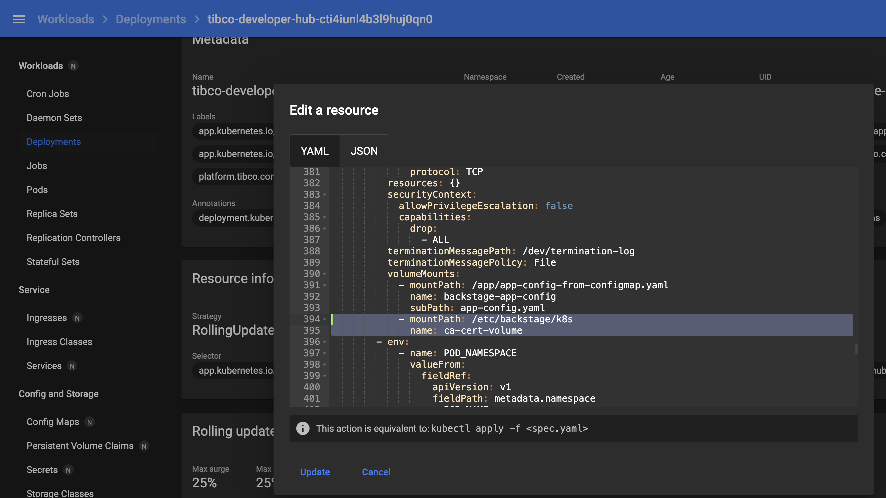
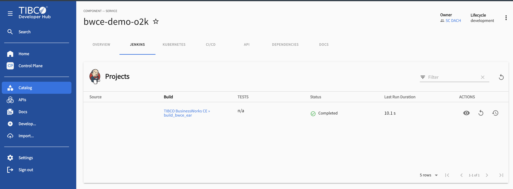
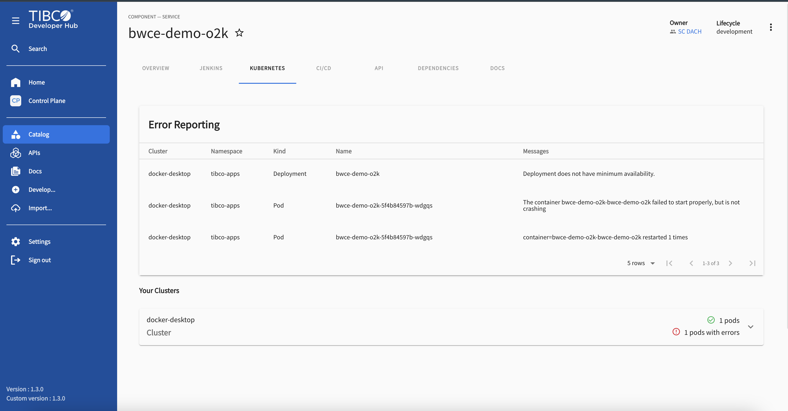
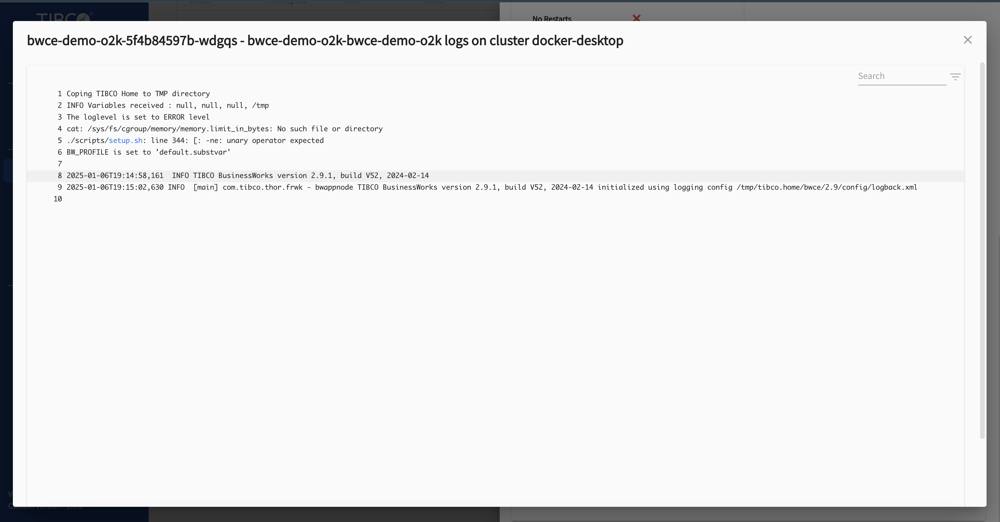

# How To Use TIBCO BWCE Templates 

This Dev Hub template simplifies the creation of new TIBCO BusinessWorks Container Edition (BWCE) projects. It automates the process of generating a basic project structure, publishing it to GitHub, registering it in the Dev Hub catalog, and optionally deploying it to Kubernetes or TIBCO Platform.

## Features

* **Project Initialization:** Creates a new BWCE project with a predefined structure.
* **GitHub Integration:** Publishes the project to a GitHub repository.
* **Dev Hub Catalog Registration:** Registers the project as a component in your Dev Hub catalog.
* **Jenkins Integration:** Triggers a Jenkins pipeline to build and deploy the application.
* **Deployment Options:** Provides options to deploy the application to either Kubernetes or TIBCO Platform.

## Requirements

* **TIBCO Platform Data Plane (Developer Hub):** A TIBCO Data Plane environment hosting Developer Hub.
* **Custom Dev Hub Image:** A custom Docker image for your Developer Hub that includes the Jenkins and Kubernetes plugins you can prepare one or (choose to use one available: `docker.io/mpandav/devhub-custom-130:latest`).
* **Jenkins:** A Jenkins server with the necessary plugins and configuration to build and deploy BWCE applications. 
  * Deploy you jenkins server using [quick setup script available here](https://github.com/mpandav-tibco/external-tools-installation/tree/main/jenkins)  
  * (see the [Jenkins Build Script README](link-to-jenkins-readme.md) for details).
* **Kubernetes Cluster (optional):** A Kubernetes cluster if you choose to deploy the application to Kubernetes.

## Usage

1.  **Install the template:** Add this template to your Dev Hub instance by including it in the `scaffolder` configuration in your `app-config.yaml` file.
2.  **Create a new component:** In the Dev Hub catalog, click "Create Component" and select this template.
3.  **Fill in the parameters:** Provide the required information in the template form, including:
    *   Project name and description.
    *   Target system (if applicable).
    *   Owner of the component.
    *   Repository location (GitHub URL).
    *   Deployment options (if you want to deploy the application):
        *   Deployment target (Kubernetes or TIBCO Platform).
        *   Deployment details (namespace, tokens, etc.).
4.  **Submit the form:** Click "Create" to generate the project and trigger the Jenkins pipeline.

## Jenkins Trigger

This template includes a step that triggers a Jenkins pipeline to build and deploy the BWCE application. The Jenkins job is configured to receive parameters from the template, including the Git repository URL, project details, and deployment options.

The Jenkins pipeline typically performs the following actions:

*   Clones the Git repository.
*   Builds the BWCE application EAR file using Maven.
*   Creates a Docker image containing the application.
*   Optionally deploys the application to Kubernetes or TIBCO Platform.
*   Pushes the updated code and artifacts back to the Git repository.

For detailed information about the Jenkins pipeline and its configuration, see the [Jenkins Build Script README](link-to-jenkins-readme.md).

## Kubernetes Deployment

If you choose to deploy the application to Kubernetes, the template will generate or update a Kubernetes Deployment YAML file. This file defines the deployment configuration, including the deployment name, container name, Docker image, resource limits, health checks, and labels.

The Dev Hub Kubernetes plugin can then be used to visualize and manage the deployed Kubernetes resources in your Dev Hub catalog.

## Dev Hub Catalog Integration

This template registers the new BWCE project as a component in your Dev Hub catalog. This allows you to:

*   View the component's details, including its description, owner, and repository location.
*   Track the component's lifecycle and dependencies.
*   Access related tools and documentation.

## Developer Hub Configuration

To use this template, you'll need to configure your Developer Hub (`app-config.yaml`) with the necessary settings for authentication, GitHub integration, catalog rules, proxy endpoints for Jenkins, and Kubernetes integration. Refer to the Dev Hub documentation for detailed instructions on configuring these settings.

 ### app-config.yaml  

    // config starts here from auth
    
    auth:
    providers:
        github:
        development:
            clientId: ${GIT_CLIENT_ID}
            clientSecret: ${GIT_CLIENT_SECRET}
        oauth2Proxy:
        development: {}
    enableAuthProviders:
        - oauth2Proxy
        - github
    integrations:
    github:
        - host: github.com
        token: ${GITHUB_TOKEN}
    catalog:
    rules:
        - allow:
            - Component
            - API
            - Location
            - Template
            - User
            - Group
            - Domain
            - System
            - Resource
    proxy.endpoints:
    /jenkins/api:
        target: ${JENKINS_URL}
        changeOrigin: true
        headers:
        Authorization: Basic ${JENKINS_AUTH_HEADER}
    jenkins:
    baseUrl: ${JENKINS_URL}
    username: ${JENKINS_USERNAME}
    apiKey: ${JENKINS_AUTH_HEADER}
    jenkinsActionSecretEncryptionKey: ZGVtbzEyMw==
    jenkinsActionJobAuthToken: ${JENKINS_ACTION_AUTH_TOKEN}
    kubernetes:
    serviceLocatorMethod:
        type: multiTenant
    clusterLocatorMethods:
        - type: config
        clusters:
            - url: ${K8S_CLUSTER_URL}
            name: ${K8S_CLUSTER_NAME}
            authProvider: ${K8S_CLUSTER_AUTH_PROVIDER}
            skipTLSVerify: ${K8S_CLUSTER_SKIP_TLS_VERIFY}
            skipMetricsLookup: ${K8S_CLUSTER_SKIP_METRCS_LOOKUP}
            serviceAccountToken: ${K8S_CLUSTER_SERVICE_ACCOUNT_TOKEN}
            caData: ${K8S_CLUSTER_CONFIG_CA_DATA}
            caFile: ${K8S_CLUSTER_CONFIG_CA_FILE}

### Kubernetes configmap
Configmap holding values for environment varibale declared in app-config.yaml. We provide this configmap while provisioning dev hub instance.

    //configmap 
    ubuntu@ip-172-31-9-71:~/work/devhub$ cat tibco-hub-secrets.yaml 
    apiVersion: v1
    kind: Secret
    metadata:
    name: tibco-hub-secrets
    namespace: <<NAMESPACE>>
    type: Opaque
    stringData:
    GITHUB_TOKEN: <<YOUR GITHUB TOKEN>>
    GIT_CLIENT_ID: <<GIT_CLINET_ID>>     // THIS IS FOR GITHUB ACTIONS CICD TAB - CREATE OAUTH APP TO GET ID AND TOKEN
    GIT_CLIENT_SECRET: <<GIT_CLINET_SECRET>>    // THIS IS FOR GITHUB ACTIONS CICD TAB - CREATE OAUTH APP TO GET ID AND TOKEN
    JENKINS_URL: http://jenkins.localhost.dataplanes.pro <<JENKINS_URL>>
    JENKINS_AUTH_HEADER: <<JENKINS_AUTH_TOKEN>>
    JENKINS_ACTION_AUTH_TOKEN: tibco <<ACTION_TOKEN - CAN BE ANYTHING>>
    JENKINS_USERNAME: devhub-bot <<JENKINS_USER>>
    K8S_CLUSTER_URL: https://192.168.49.2:8443 <<K8S_CLUSTER_URL>>
    K8S_CLUSTER_NAME: docker-desktop / <<K8S_CLUSTER_NAME>>
    K8S_CLUSTER_AUTH_PROVIDER: 'serviceAccount'
    K8S_CLUSTER_SKIP_TLS_VERIFY: 'true'
    K8S_CLUSTER_SKIP_METRCS_LOOKUP: 'false'
    K8S_CLUSTER_SERVICE_ACCOUNT_TOKEN: <<SERVICE_ACCOUNT_TOKEN>>
    
**NOTE**
caData: 
caFile: 
    
    Are required for backstage to successfully able to connect with your k8s API server. You will find these files for minikube and docker-desktop under .kube/config file. 
    Once you have the cert available then import them into same secret and refer them as volume into deployment config  of developer-hub.
    
    Interestingly(for good), any change in the dev hub config does not change / remove these deployment updates.

devhub Secret having caFile:

Developer Hub Deployment volume and volumemount udpate:

## Service Account for Dev Hub K8S Plugin
Backstage [k8s plugin](https://backstage.io/docs/features/kubernetes/) requires read access to your k8s cluster to collect and get components data and details. You can [devhub-sa.yaml](./devhub-sa.yaml) to create one and using that generate token. 

### Generate Token
Get a long-lived token by creating a secret

    kubectl apply -f - <<EOF
    apiVersion: v1
    kind: Secret
    metadata:
    name: <SECRET_NAME>
    namespace: <NAMESPACE>
    annotations:
        kubernetes.io/service-account.name: <SERVICE_ACCOUNT_NAME>
    type: kubernetes.io/service-account-token
    EOF

Wait for the token controller to populate a token, and retrieving it with:

    kubectl -n <NAMESPACE> get secret <SECRET_NAME> -o go-template='{{.data.token | base64decode}}'

## Result
- Create new component from Template 
- Fill out Repository Location 
- Choose whether to deploy and if deployment target 
- Review and create 
- Run the template and Result 
- Check component in catalog -> Jenkins Tab -> Pipeline Result   
- Check K8S Tab ->      