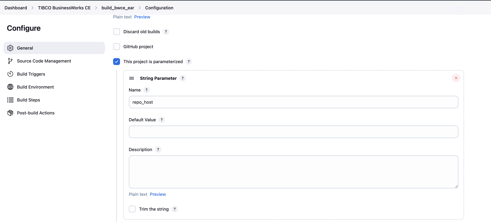
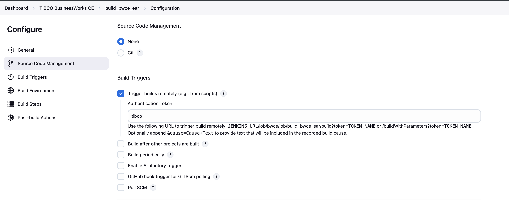
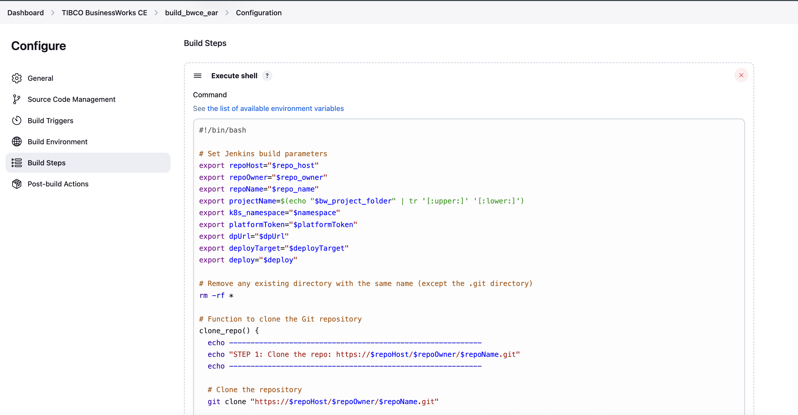

# Jenkins Pipeline for TIBCO BWCE Dev Hub Templates

This repository contains a shell script (`jenkins-trigger-bwce-build.sh`) that automates the build and deployment process for TIBCO BusinessWorks Container Edition (BWCE) applications within a Jenkins pipeline.

## Features

* Clones the Git repository for the BWCE project.
* Builds the application EAR using Maven.
* Creates a Docker image containing the application.
* Updates the Kubernetes deployment YAML file.
* Optionally deploys the application to Kubernetes or TIBCO Platform.
* Pushes the updated code and artifacts back to the Git repository.

## Prerequisites

* Jenkins server with a configured agent that has the following tools installed:
    * Git
    * Maven
    * Docker
    * `yq` (YAML processor)
* A Kubernetes cluster (if deploying to Kubernetes).
* TIBCO Platform Data Plane (if deploying to Platform).

## Usecase Scenario

## Jenkins Job Configuration

1. **Create a new Jenkins job:**
- Go to your Jenkins dashboard and click "New Item."
    - Choose "Freestyle project" or "Pipeline" and give it a name (e.g., "BWCE-Build").
    - Click "OK."
    - Follow steps documented [here](https://github.com/mpandav-tibco/tibco-developer-hub/tree/main/examples/plugin-scaffolder-backend-module-trigger-jenkins-job) in the example.

2. **Configure source code management:**
   - In the "Source Code Management" section, select "Git."
   - Enter the repository URL (e.g., `https://github.com/mpandav-tibco/bwce-demo.git`).
   - If necessary, configure credentials to access the repository (see "Jenkins Credentials" below).

3. **Add build parameters:**
   - In the "General" section, check the "This project is parameterized" checkbox.
   - Add the following string parameters (no need to specify default values):
     * `repo_host` (e.g., `github.com`)
     * `repo_owner` (e.g., `mpandav-tibco`)
     * `repo_name` (e.g., `bwce-demo`)
     * `bw_project_folder` (e.g., `OrderToKafka`)
     * `namespac` (e.g., `tibco-apps`)
     * `platformToken` (if deploying to TIBCO Platform)
     * `dpUrl` (if deploying to TIBCO Platform)
     * `deployTarget` (e.g., `K8S` or `TIBCO Platform`)
     * `deploy` (e.g., `true` or `false`)
    
    - Reference snaps:
      - This project is parameterized 
  
      - Build Triggers  
    
4. **Execute the shell script:**
   - In the "Build" section, add an "Execute shell" build step.
   - Paste the contents of `jenkins-trigger-bwce-build.sh` into the script area.
   
   - Build Step 
5. **(Optional) Post-build actions:**
   - If you want to archive artifacts or perform other actions after the build, configure them in the "Post-build Actions" section.

## Jenkins Credentials

* **Git Credentials:**
   - Go to Jenkins -> "Credentials" -> "System" -> "Global credentials (unrestricted)."
   - Click "Add Credentials."
   - Choose "Kind" as "Username with password" or "SSH Username with private key" depending on your Git authentication method.
   - Fill in the required details (username, password, or private key).
   - Click "OK."
   - In your Jenkins job configuration, select the created credential in the "Source Code Management" section.

* **Docker Credentials:**
   - If you're pushing Docker images to a registry, you'll need to configure Docker credentials in Jenkins.
   - Follow a similar process as for Git credentials, but choose "Kind" as "Secret text" and provide your Docker registry username and password or API token.

* **Kubernetes Credentials:**
   - If you're deploying to Kubernetes, configure Kubernetes credentials in Jenkins.
   - You can use a kubeconfig file, a service account token, or other authentication methods supported by Kubernetes.
   - Refer to the Jenkins Kubernetes plugin documentation for details on configuring credentials.

## Jenkins API Token

* **Generate an API token:**
   - Log in to Jenkins as a user with sufficient permissions.
   - Go to your user profile (click your username in the top right corner).
   - In the "API Token" section, click "Add new token."
   - Give the token a name and click "Generate."
   - Copy the generated token and store it securely. You won't be able to see it again.

* **Use the API token:**
   - You can use the API token to authenticate with the Jenkins API for various purposes, such as triggering builds remotely or accessing build information.
   - The token can be passed in the `Authorization` header of your API requests.

## Script Overview

The script performs the following steps:

1.  Clone the repository: Clones the Git repository specified by the build parameters.
2.  Build the EAR: Uses Maven to build the BWCE application EAR file.
3.  Create Docker image: Builds a Docker image containing the application EAR.
4.  Update deployment YAML: Updates the `deployment.yaml` file with the correct values for the deployment name, container name, image, and labels.
5.  Push changes to Git: Commits and pushes the updated `deployment.yaml`, `Dockerfile`, and `build-artifacts` directory to the Git repository.
6.  Deploy (conditional): Deploys the application to Kubernetes or TIBCO Platform based on the `deploy` and `deployTarget` parameters.

## Customization

*   Dockerfile: Modify the `Dockerfile` content in the script to match your specific requirements (base image, labels, etc.).
*   Deployment YAML: Adjust the `deployment.yaml` file to fit your Kubernetes deployment needs.
*   Error Handling: Add more robust error handling to the script to catch potential issues during the build or deployment process.
*   Additional Steps: Extend the script to include other steps in your CI/CD pipeline, such as running tests, performing code analysis, or sending notifications.

